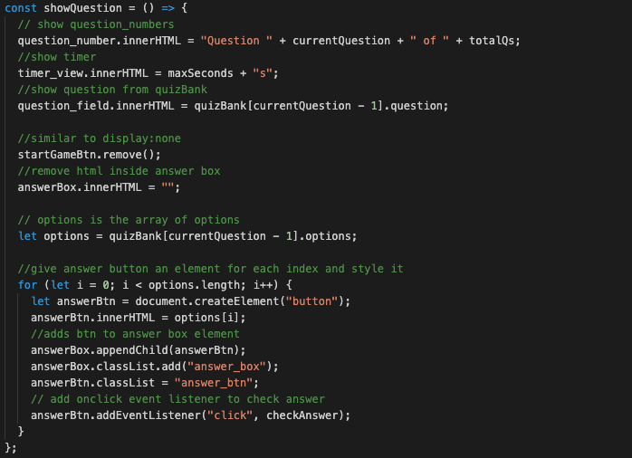

# Kavya's Timed JavaScript Quiz

## Javascript - Module 4 Challenge

## Table of Contents

- [Description](#description)
- [Technologies](#technologies)
- [Deployed Link](#link)
- [Usage](#usage)
- [User Information](#userinformation)
- [Credits](#credits)
- [License](#license)

## Description

A timed JavaScript Based MC Quiz. User can start the game and attempt to answer all questions before the timer runs out. Once the timer has run out or the user has answered all questions, they will be asked to enter their initials. Once the initials have been entered, the high scores will be displayed.

## Technologies

- HTML
- CSS
- JavaScript

## Deployed Link

[Deployed Link](https://smandla.github.io/javascript_timedquiz/)

## Usage

### Website Demo

### Code Snippet

#### Function displays question based on certain variables and updates the look of the UI. For loop that creates buttons for each option.

## User Information

[LinkedIn](https://www.linkedin.com/in/srikavya-mandla/) |
[Portfolio](https://smandla.github.io/kavya_professionalportfolio/)

## Credits

Credits to University of California, Berkeley.

## License

---

© 2022 Trilogy Education Services, LLC, a 2U, Inc. brand. Confidential and Proprietary. All Rights Reserved.
